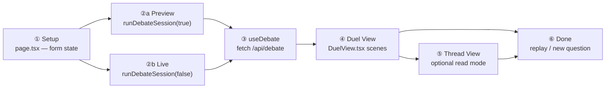
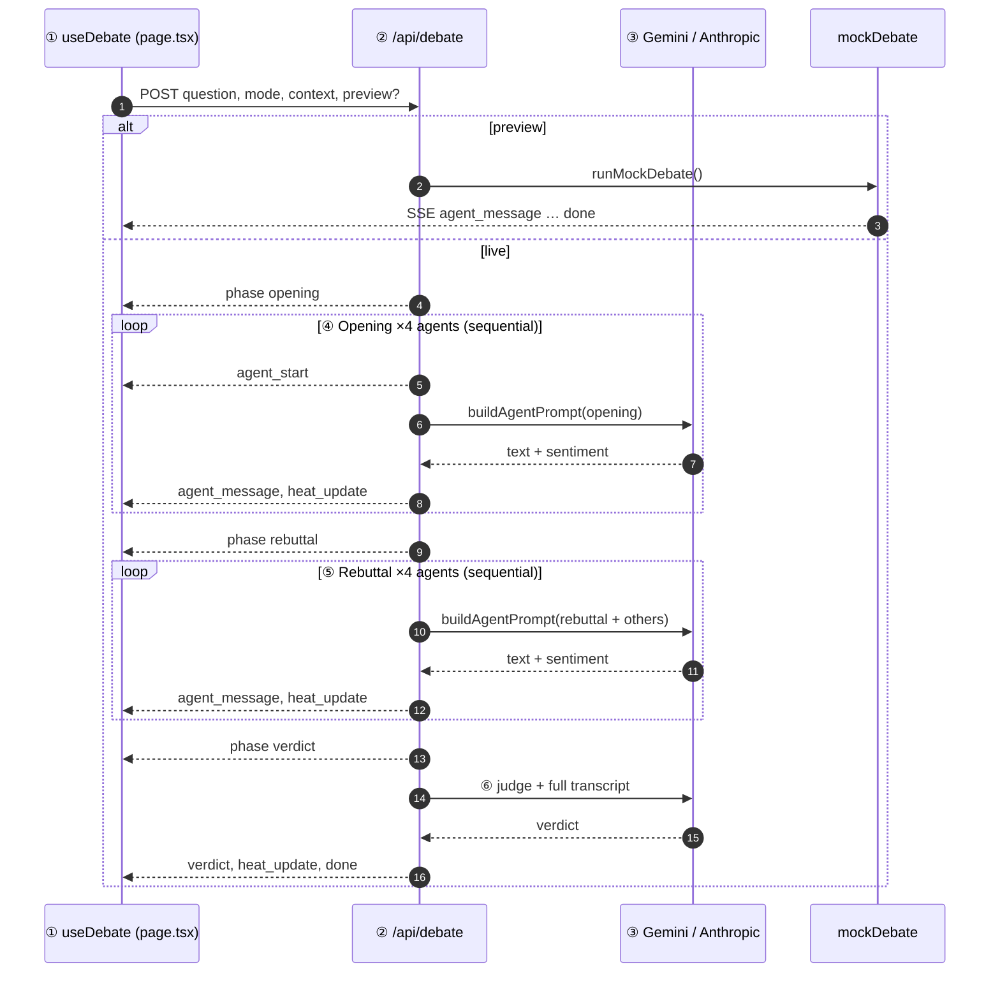
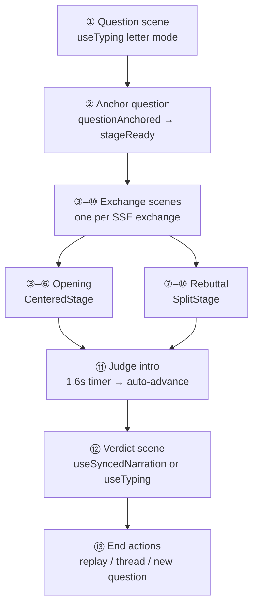
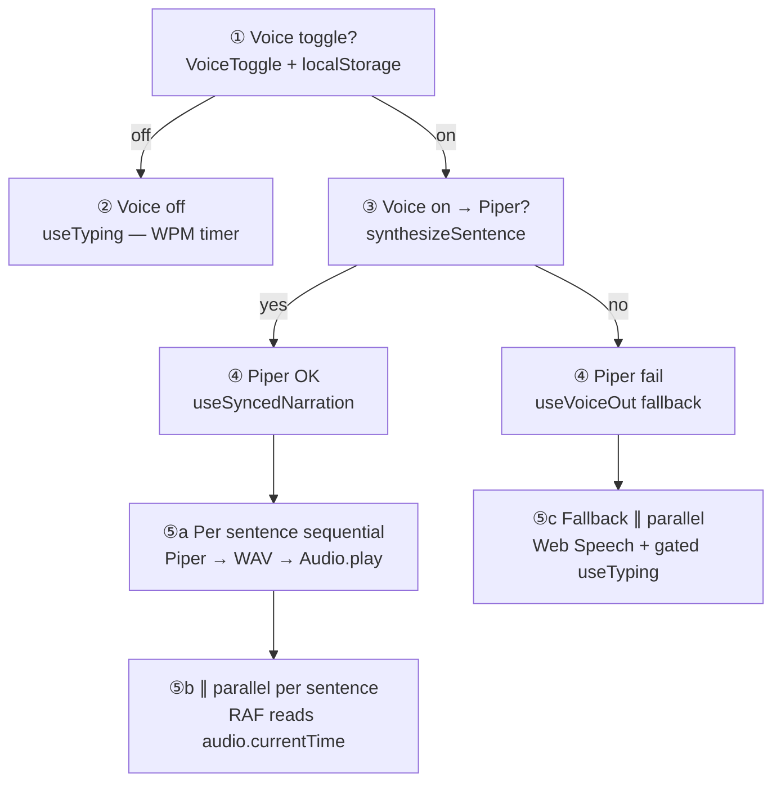

# Council of Agents

Five specialized AI agents debate your hardest decisions in real time.

## How it works

These diagrams live in this README as [Mermaid](https://mermaid.live) blocks — edit the text below to update the visuals.

**Legend:** steps with the same number group run **in order**; steps marked **∥ parallel** run at the same time as another track.

### 1. User journey



**What runs:** `page.tsx` collects the question, mode, and context, then calls `runDebateSession` which hands off to `useDebate` → `POST /api/debate`. **Parallel:** while ④ Duel plays scenes at your pace, ③ keeps receiving SSE in the background and appends new `exchanges` / `verdict` to React state; `AmbientBackground` and heat hooks update on every message **∥ parallel** to the scene you are watching.

### 2. Debate generation (server)

`POST /api/debate` streams Server-Sent Events. LLM calls are **sequential** (one agent at a time); the browser read loop runs **∥ parallel** to whatever Duel scene is on screen.



**What runs:** `route.ts` loops `DEBATE_AGENTS_ORDER` twice (opening, then rebuttal), then one judge call — each step awaits `callLLM` before the next. **Parallel:** the SSE `ReadableStream` write on the server and the client `fetch` reader in `useDebate` overlap continuously; each `agent_message` also triggers `onHeatUpdate` / `updateHeat` in `page.tsx` **∥ parallel** to Duel scene playback.

**Agent order (sequential):** Optimist → Contrarian → Pragmatist → Oracle → Judge.

### 3. Duel View scenes (client)

Duel walks a numbered scene list; advancement is **sequential** (Space / auto-advance). New exchange text arrives from SSE **∥ parallel** while you may still be on an earlier scene.



**What runs:** `DuelView.tsx` builds `scenes[]` from `exchanges` + `verdict`; each scene picks narration hooks and stage layout (`CenteredStage` / `SplitStage`). **Parallel:** scene ③–⑩ only advances when `canAdvance` sees content for the next exchange — so SSE step 2 on the server and Duel scene ⑤ on screen can be at different numbers at once; `CouncilRoster`, `SentimentPulse`, and `DebateStatusBar` re-render on every word tick **∥ parallel** to the active scene.

### 4. Voice + text sync (client)

One **master clock** per path. Old design ran typing + Web Speech on separate timers (**∥ drift**); Piper path locks text to audio progress.



**What runs:** `useSyncedNarration` splits text into sentences, calls `piper.ts` → `TtsSession.predict`, sets `playbackRate` from WPM, then drives `displayed` text from `audio.currentTime / duration`. **Parallel vs sequential:** sentences are **sequential** (⑤a); inside each sentence, `audio.play()` and the `requestAnimationFrame` loop are **∥ parallel** (⑤b); fallback path speaks one sentence via `useVoiceOut` while `useTyping` types only that sentence (⑤c, still **∥ parallel**, but gated so text never races ahead).

| Step | Path | Executes | Master clock | Parallel with |
|------|------|----------|--------------|---------------|
| ② | Voice off | `useTyping` | WPM `setTimeout` | — |
| ④–⑤b | Piper | `useSyncedNarration` + `piper.ts` | Audio element | RAF text reveal **∥** audio |
| ④–⑤c | Fallback | `useVoiceOut` + `useTyping` | Web Speech per sentence | Typing current sentence **∥** speech |

## Stack

- Next.js 14 (App Router, TypeScript)
- Anthropic SDK (`@anthropic-ai/sdk`)
- Tailwind CSS
- Framer Motion

## Setup

1. Clone the repository:

```bash
git clone git@github.com:cosmic-hash/Council-of-Agents.git
cd Council-of-Agents
```

2. Install dependencies:

```bash
npm install
```

3. Copy environment variables:

```bash
cp .env.example .env.local
```

4. Add your Gemini API key to `.env.local`:

```
GEMINI_API_KEY=your-gemini-api-key-here
GEMINI_MODEL=gemini-3.1-flash-lite
GEMINI_MAX_TOKENS=500
```

Anthropic is supported as a fallback if `GEMINI_API_KEY` is unset.

5. Run the development server:

```bash
npm run dev
```

Open [http://localhost:3000](http://localhost:3000).

## Features

- **Three debate modes** — Normal, Moderate, Aggressive
- **Try preview** — full debate UI with mock responses, no API key required
- **Duel View** — Cinematic full-screen debate experience
- **Thread View** — Read the full debate as a feed
- **Live heat system** — Background responds to debate tension
- **User context** — Optional personalization saved to localStorage
- **First-time onboarding** — Optional "About you" prompt on first visit
- **SSE streaming** — Sequential agent responses via `/api/debate`
- **White theme** — Light surfaces with agent colors and heat washes

## Preview mode

Click **Try preview** on the setup screen to run a canned debate without configuring an API key. Live debates require `GEMINI_API_KEY` in `.env.local`.

## Deploying (temporary share link)

**Recommended host:** [Vercel](https://vercel.com) — native Next.js support, free hobby tier, HTTPS, and encrypted environment variables for API keys.

This app needs a **server** (API routes at `/api/debate` and `/api/health`). Static-only hosts (GitHub Pages, Netlify static export) will not work.

### Secrets checklist

| Variable | Where to set | Never put it in |
|---|---|---|
| `GEMINI_API_KEY` | Vercel → Project → Settings → Environment Variables | Git, README, client code, chat |
| `GEMINI_MODEL` | Same | Committed `.env.local` |
| `GEMINI_MODEL_FALLBACKS` | Same (comma-separated, optional) | — |
| `GEMINI_MAX_TOKENS` | Same (optional, `500`) | — |

Local development: copy [`.env.example`](.env.example) to `.env.local` (already gitignored).

If a key was ever exposed, rotate it in [Google AI Studio](https://aistudio.google.com/apikey) before deploying.

### Deploy steps

1. Push your branch to GitHub.
2. Import the repo on Vercel (framework: Next.js, auto-detected).
3. Add environment variables **before** the first production deploy (see table above).
4. Deploy and share the `https://your-project.vercel.app` URL.

**Preview-only deploy:** omit `GEMINI_API_KEY` — **Try preview** still works; live **Convene the Council** will be disabled.

**Live debates:** add `GEMINI_API_KEY` on the server only. The key never reaches the browser; anyone with the URL can consume your API quota, so share the link privately and rotate the key when done.

Alternatives with the same secret pattern: Railway, Render, Fly.io.

## Tests

```bash
npm test
```

## The Council

| Agent | Role |
|---|---|
| The Optimist | Finds upside and opportunity |
| The Contrarian | Challenges assumptions |
| The Pragmatist | Assesses feasibility |
| The Oracle | Maps risks and scenarios |
| The Judge | Delivers the verdict |

## License

MIT
